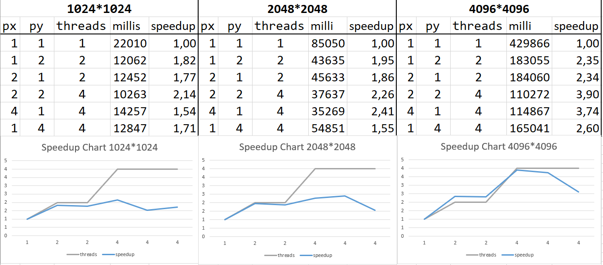

# Labor 03

## Aufgabe 1 g
* Welche Probleme ergeben sich im Zusammenhang mit einer 2D Gebietszerlegung?
  * Daten sind nicht aneinanderliegend im Speicher -> Können nicht ohne weiteres an anderen Worker gesendet werden
  * Komplexe MPI-Datentypen benötigt
* Welche Vorraussetzungen müssen an den Aufrufer des Programms gestellt werden?
  * Das Feld sollte in jeder Dimension durch die Anzahl an Threads teilbar sein.

## Aufgabe 2
* Verhältnis von nX & pX hat keine so großen Auswirkungen wie bei openMp
* 4 x Größeres Spielfeld braucht ca. 4 x mehr Zeit

### Speedup Chart

